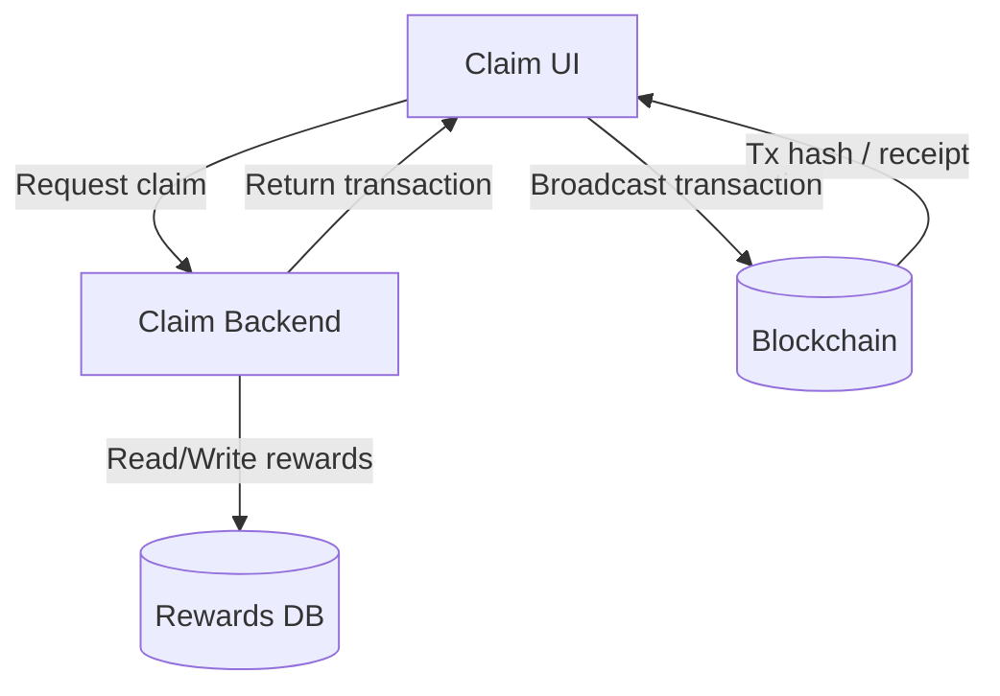
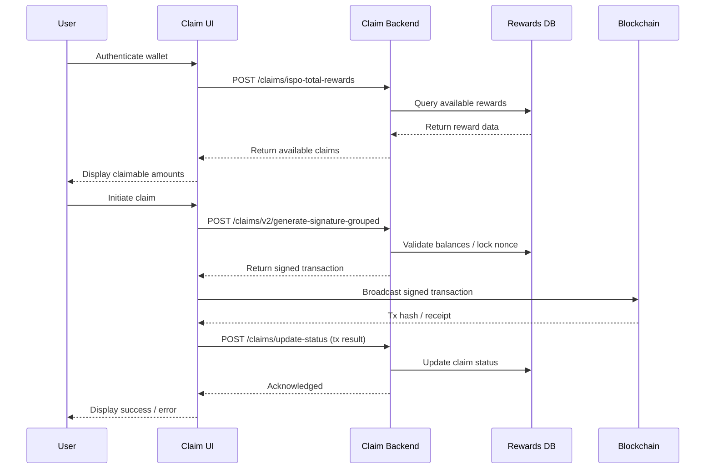

# System Architecture — ISPO, NFT, Claim UI & Claim Backend
**Date:** December 2024  
**Version:** 1.0

## 1) Executive Summary

This system provides a comprehensive multi-blockchain reward distribution and NFT management platform for DEGA token staking across Ethereum, Polkadot, Cardano, and Meld networks. The platform consists of four core modules: ISPO Service (reward calculation and distribution), NFT Service (digital asset management), Claim UI (user interface for claims), and Claim Backend (transaction processing and signing).

The system implements a complete rewards pipeline from staking data collection and reward calculation through to user claim processing and blockchain transaction execution. Key flows include automated reward distribution across multiple chains and secure claim processing with blockchain transaction signing on Ethereum and Cardano. The platform supports cross-chain operations with unified data models and coordinated scheduling mechanisms.

## 2) Goals & Non-Goals

### Goals

- Allow DEGA token stakers to claim rewards across multiple chains in one platform.
- Support unified user experience for claiming on Ethereum and Cardano, abstracting underlying blockchain complexity.

### Non-Goals

- No direct on-chain reward calculation — all calculations are performed off-chain in backend services.
- No claims on all chains — rewards can only be claimed on Ethereum and Cardano.
- No implementation of additional blockchain support beyond Ethereum, Cardano, Polkadot, and Meld for staking data ingestion.

## 3) System Context & Component Map

- **ISPO Service**: Handles staking reward calculations, TGE unlock schedules, bonus reward processing, and blockchain data aggregation across multiple networks
- **NFT Service**: Manages digital assets creation, element ownership tracking, and NFT minting operations
- **Claim UI**: Provides user interface for claim processing, wallet authentication, and reward visualization across multiple blockchains
- **Claim Backend**: Processes claim requests, generates signed transactions, manages UTXO lifecycle for Cardano

## 4) Deployment & Environment Setup

**Services**: All core services (ISPO, NFT, Claim Backend) run in Docker containers on a dedicated Services VM in GCP. Deployment is manual for backend services.

**UI**: Runs on GCP Cloud Run with CI/CD pipelines triggered via GitHub Actions.

**Environments**:
- **Develop/Local** — developer workstations and local Docker environments.
- **UAT (Cloud)** — full replica of production environment using blockchain testnets.
- **Production (Cloud)** — mainnet deployment.

**Networking**: Isolated VPC between MongoDB Atlas and Services VM.

**Reverse Proxy**: Configured in the Services VM for routing and SSL termination.

**Domain Management**: Domains managed through Cloudflare for DNS and protection.

## 5) Technology Stack & Dependencies

**Languages & Frameworks**: All services written in TypeScript.

**Database**: MongoDB Atlas v6.

**Schedulers**: Configured in GCP, invoking Pub/Sub topics to trigger a consumer module that makes HTTP calls to sibling services for execution.

**Deployment Tools**: GitHub Actions for CI/CD; manual deployment for some backend services.

**External Integrations**:
- **Ethereum**: Ethers.js for contract calls and signing.
- **Cardano**: @meshsdk/core, @blockfrost/blockfrost-js.
- **Polkadot/Meld**: API providers for staking data retrieval.

## 6) Security Model

**Service Exposure**: All services are internal-only except the public-facing backend, which forwards requests to internal services.

**User Authentication**: Wallet-based signature verification with JWT generation for cookie-based authentication.

**Traffic Security**: All frontend–backend communications over HTTPS (TLS).

**Data Security**: No encryption at rest for database data, as it is already public on-chain.

**Key & Secret Management**: Signing keys and secrets stored in GCP Secret Manager; accessed only by isolated Services VMs via IAM roles.

**Network Controls**: All ports closed except 443 for backend; internal communications restricted to VPC.

## 7) Data Model (System Summary)

The system maintains core entities for user management, reward tracking, NFT ownership, and claim processing across multiple blockchains. Key entities include user profiles with cross-chain addresses, comprehensive reward ledgers with period tracking, NFT collections with ownership mapping, and claim processing with transaction status tracking.

| Entity/Table | Key Fields | Important Indexes |
|--------------|------------|-------------------|
| Rewards | address, token, amountInDega, type, periodId | address+processDate, periodId+token+type |
| TGEUnlockClaim | address, source_id, unlock_date, amount, status | periodType |
| TGEClaim | user_id, address, total_amount, status, signature | user_id+claim_date, txHash, status |
| UTXO | txHash, index, amount, status, utxocombined | txHash+index unique, status, lockedAt |
| Elements | owner, class, chainId, tokenId, reward | owner unique, chainId+tokenId+unitId unique |
| Users | address, tribe, referralCode, referredBy | address, referralCode, referredBy |

## 8) Reward Calculation & NFT Flow

### Reward Calculation Flow

- For each chain, an API provider supplies stake amounts at contract or protocol level.
- At each service run, all participant addresses are listed and a snapshot is stored.
- Snapshot data is used to calculate rewards linearly (X amount staked = X amount of DEGA tokens).
- Calculated rewards are stored in MongoDB for later claim processing.

### NFT Minting Flow

- User initiates NFT purchase in frontend.
- Backend generates a signature using secret keys.
- Signed transaction is returned to frontend for payment and blockchain broadcast.
- Trustless minting enforced on-chain — payment and mint tied in same transaction via smart contract or UTXO logic.

## 9) Main Runtime Flows (End‑to‑End)

**Rewards Pipeline Flow:**
- ISPO Service collects staking data from multiple blockchains (Ethereum, Polkadot, Cardano, Meld)
- Reward calculations are performed based on staking amounts and time periods
- Results are stored in MongoDB with period tracking and user mapping
- TGE unlock schedules are processed and claim records are created
- Bonus rewards (New Year, Summer, Solstice, Stackable) are calculated and distributed

**Claim Flow:**
- User authenticates via Claim UI using multi-chain wallet
- UI queries Claim Backend for available rewards and claim status
- User initiates claim request through UI
- Claim Backend generates signed transaction using Google Cloud Secret Manager keys
- The UI receives the signed transaction from the Claim Backend
- The UI broadcasts the signed transaction directly to the blockchain and reports status back to the Claim Backend.
- UTXO lifecycle is managed for Cardano claims (available → locked → consumed/void)
- Claim status is updated in database upon confirmation

## 10) Chains & Signing

- **Ethereum**: Ethers.js integration for staking contract interactions and claim verification, EIP-712 signature generation for claim transactions
- **Cardano**: @meshsdk/core for wallet operations and address resolution, @blockfrost/blockfrost-js for UTXO management, mnemonic-based backend wallet for transaction signing

## 11) Scalability & Performance

**Backend**: Single instance with no horizontal scaling; capacity sufficient to handle expected traffic at multiple orders of magnitude above baseline.

**Frontend**: Horizontally scalable via GCP Cloud Run.

**Caching**:
- CDN caching for images in GCP.
- Backend in-memory caching for token pricing with TTL and DB fallback.

**Load Testing**: No formal load tests performed.

## 12) Scaling Notes & "Snowball" Effect

**Growth Mechanics**
Reward generation in the original design combined multiple independent streams:

- **ISPO Rewards**: ≈500,000 rewards records from the initial stake distribution.
- **NFT Rewards**: ≈15,000 Elements, each producing a daily unlock for the owner.
- **Vesting**: Rewards were not claimed in a single transaction; instead, they unlocked daily over a vesting schedule.
- **Multi-stream accrual**: Users could have rewards from ISPO, NFTs, and vesting all accruing simultaneously.

Over 244 days of vesting, this compounded into roughly 125 million individual unlock records in the database.
When a user made a claim, the system updated all relevant unlocks for that user — meaning even a single claim could touch thousands of rows.

**Impact**
- DB load from both the reward accrual (inserts) and claims (bulk updates).
- High index churn and slow queries for aggregation.
- Increased complexity in UTXO and transaction preparation due to fragmented unlocks.

**Solution Implemented**
- **Daily Grouping**: The system maintains the original individual unlock records but adds a grouping process that aggregates all unlocks for a given address into single grouped unlocks per day.
- **Grouped Claims**: Claims were modified to accept these daily grouped unlocks, drastically reducing the number of DB rows touched during a claim. While claims now operate on grouped unlocks, the original per-unlock records are preserved for audit and calculation purposes.
- **Backend Processing**: The grouping process runs in a backend service that can operate slowly and confidently, as it doesn't need to be fast for user-facing operations.

**Result:**
- Reduced transaction complexity for claims.
- Faster claim processing and less DB contention.
- Original unlock records remain intact for audit and calculation purposes.

## 13) Monitoring, Logging, and Alerting

**Monitoring Tools**: Datadog for service metrics and logs, GCP Monitoring for infrastructure and service health.

**Logging**: All relevant service logs streamed to Datadog.

**Alerts**: Configured via Datadog and GCP Monitoring with email notifications.

## 14) Additional Technical Details

- **Source of truth for claimable balance calculation**: Calculated and stored off-chain in the database.
- **Rate limiting strategy for external blockchain API calls**: Implemented in code for services such as Subscan and Blockfrost.
- **Database connection pooling and cluster configuration**: Configured to connect to a MongoDB Atlas cluster with retry mechanisms enabled.
- **Error handling for blockchain transaction failures**: Handled in code; failures do not affect stored data.
- **Monitoring and alerting**: Implemented in production to track failed reward distributions and claim processing events.
- **Backup and disaster recovery procedures**: Automated backups are configured for MongoDB Atlas; recovery process is tested periodically.

## 15) Risks & Mitigations
- **Security Boundary Risk**: No authentication on reward distribution endpoints - mitigated by closed environment deployment and internal scheduler-only 
access
- **Data Integrity Risk**: Concurrent claim processing could lead to double-spending - mitigated by idempotent operations and UTXO locking mechanisms
- **Key Management Risk**: Private keys stored in Google Cloud Secret Manager - mitigated by secure credential management and access controls
- **Blockchain API Risk**: External API failures could disrupt reward calculations - mitigated by retry mechanisms and idempotent job processing
- **UTXO Management Risk**: Cardano UTXO expiration could lead to lost funds - mitigated by timeout configurations and void/recycle processes

## 16) Glossary

### Blockchain & Cryptocurrency Terms

**Cardano**: A proof-of-stake blockchain platform that uses UTXO model for transaction processing and supports smart contracts.

**DEGA**: The native token of the platform, distributed as rewards to stakers across multiple blockchains.

**EIP-712**: Ethereum Improvement Proposal that defines a standard for typed structured data signing, used for secure transaction signing.

**Ethereum**: A decentralized blockchain platform that supports smart contracts and is the foundation for many DeFi applications.

**ISPO (Initial Stake Pool Offering)**: A fundraising mechanism where users stake their tokens to earn rewards in a new token, used for DEGA token distribution.

**Meld**: A blockchain platform focused on DeFi applications, one of the supported networks for staking data.

**NFT (Non-Fungible Token)**: Unique digital assets that represent ownership of specific items, managed by the NFT Service in this system.

**Polkadot**: A multi-chain blockchain platform that enables different blockchains to interoperate and share security.

**Staking**: The process of participating in a blockchain network by locking up tokens to earn rewards and help secure the network.

**TGE (Token Generation Event)**: The initial distribution event where new tokens are created and distributed to participants.

**UTXO (Unspent Transaction Output)**: A transaction model used by Cardano and Bitcoin where each transaction consumes previous outputs and creates new ones.

### Infrastructure & Cloud Services

**CDN (Content Delivery Network)**: A distributed network of servers that deliver content to users based on geographic location, used for caching images in GCP.

**CI/CD (Continuous Integration/Continuous Deployment)**: Automated software development practices that enable frequent code changes and automated testing and deployment.

**Docker**: A platform for developing, shipping, and running applications in containers, used to package all core services.

**GCP (Google Cloud Platform)**: Google's cloud computing platform providing infrastructure and services for hosting applications.

**GitHub Actions**: A CI/CD platform integrated with GitHub that automates software workflows, used for deployment pipelines.

**IAM (Identity and Access Management)**: A framework for managing digital identities and controlling access to resources in cloud environments.

**MongoDB Atlas**: A cloud-hosted MongoDB database service providing managed database clusters with automated backups and scaling.

**Pub/Sub (Publish/Subscribe)**: A messaging service that enables asynchronous communication between services, used for triggering scheduled tasks.

**VPC (Virtual Private Cloud)**: An isolated network environment in the cloud that provides secure communication between resources.

### Technical & Development Terms

**API (Application Programming Interface)**: A set of rules that allows different software applications to communicate with each other.

**Backend**: Server-side components of an application that handle business logic, data processing, and external service integration.

**Blockchain**: A distributed ledger technology that maintains a continuously growing list of records secured by cryptography.

**Frontend**: Client-side components of an application that provide the user interface and handle user interactions.

**HTTPS (Hypertext Transfer Protocol Secure)**: A secure version of HTTP that encrypts data transmitted between web browsers and servers.

**JWT (JSON Web Token)**: A compact, URL-safe means of representing claims to be transferred between parties, used for authentication.

**Load Testing**: A type of performance testing that evaluates how a system behaves under expected and peak load conditions.

**Mainnet**: The production blockchain network where real transactions occur, as opposed to testnet environments.

**Mnemonic**: A sequence of words used to generate and recover cryptographic keys, used for backend wallet operations.

**Off-chain**: Processes or data storage that occur outside of the blockchain, typically in traditional databases or services.

**On-chain**: Processes or data that are recorded directly on the blockchain and validated by the network.

**SSL/TLS (Secure Sockets Layer/Transport Layer Security)**: Cryptographic protocols that provide secure communication over networks.

**Testnet**: A testing environment that mimics the mainnet blockchain but uses test tokens and is used for development and testing.

**TypeScript**: A programming language that extends JavaScript with static typing, used for all services in this system.

**UTXO Lifecycle**: The management of unspent transaction outputs through states: available, locked, consumed, or void.

### Business & Domain Terms

**Bonus Rewards**: Additional token rewards distributed for special events or milestones (New Year, Summer, Solstice, Stackable).

**Claim**: The process of requesting and receiving earned rewards from the system.

**Cross-chain**: Operations that span multiple blockchain networks, allowing interoperability between different platforms.

**Element**: A specific type of NFT in the system that provides daily reward unlocks to its owner.

**Idempotent**: An operation that can be performed multiple times without changing the result beyond the initial application.

**Referral Code**: A unique identifier used to track and reward users who refer others to the platform.

**Reward Pipeline**: The complete process from staking data collection through reward calculation to claim processing.

**Snapshot**: A point-in-time record of staking amounts used for reward calculations.

**Staking Data**: Information about how much users have staked across different blockchain networks.

**Tribe**: A user classification or grouping system within the platform.

**Vesting**: A mechanism where rewards are distributed over time rather than all at once, typically with daily unlocks.
